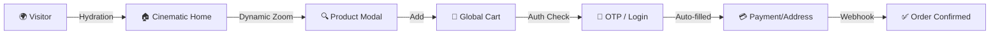

# KSR Aqua World | Cinematic Frontend Experience 🌊

A premium, immersive E-commerce storefront built with **Next.js**, **React**, and **Tailwind CSS**. Designed for the elite angling community, focusing on motion, depth, and glassmorphism.

## 🎨 Design Philosophy & Styling

The frontend utilizes a custom "Cinematic 3D" styling system designed to make flat product photos feel alive.

### 🎥 The Cinematic 3D Technique
*   **Auto-Masking**: Uses `mix-blend-color-burn` to dynamically remove white backgrounds from product JPGs, turning them into floating transparent assets without manual editing.
*   **Depth Stack**: Combines `drop-shadow-2xl` (which follows the product shape) with `blur-3xl` "Background Orbs" and `ken-burns` parallax animations.
*   **Micro-Animations**: Uses `lucide-react` icons and `framer-motion` style transitions for "Pop"-in scaling and 3D tilting on product hover.

## ⚙️ Logic & State Flows

### 🛒 Global State Management
Uses **React Context API** for high-performance state syncing across the application:
1.  **AuthContext**: Manages user lifecycle, JWT persistent storage, and OTP session states.
2.  **CartContext**: Handles client-side persistence with real-time backend synchronization during checkout.
3.  **WishlistContext**: Predictive UI—updates heart icons instantly before the server response arrives for a "lag-free" feel.

### 🗺️ Smart Geolocation
Integrated the **Nominatim (OpenStreetMap)** API for localized "Locate Me" functionality:
- Automatically reverse-geocodes user coordinates into City, State, and Pincode.
- Populates the modern checkout form to reduce friction and improve conversion rates.

## 📊 User Interaction Flow

## 🛠️ Technical Stack
- **Framework**: Next.js 16 (App Router)
- **Language**: TypeScript
- **Styling**: Tailwind CSS + Vanilla CSS Keyframes
- **Icons**: Lucide React
- **Notifications**: SweetAlert2 (Glassmorphism Styled)

## 📡 API Integration
The frontend is powered by a centralized `api.ts` utility that:
- Automatically attaches Bearer tokens to all requests.
- Handles environment-based URL switching (Local vs Production).
- Implements global error interceptors for a consistent user experience.

---
*Created with passion for the KSR Store project.*
